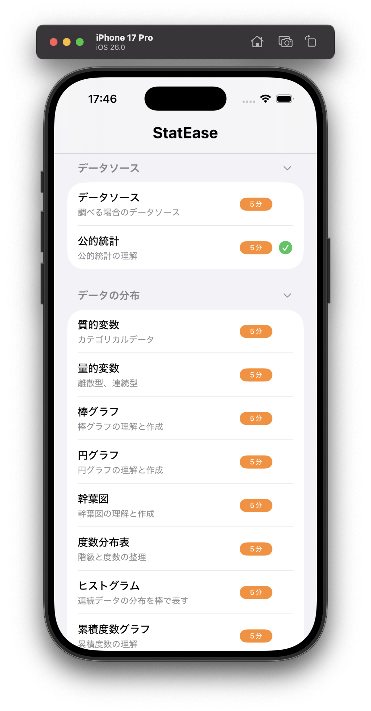
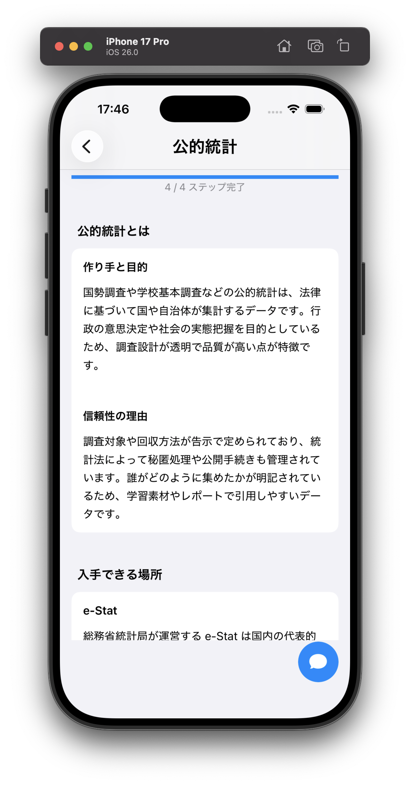

# StatEase-UIKit

統計学を楽しく学べるiOSアプリです。データソースから推測統計まで、体系的に統計学の基礎を学習できます。

## 主な機能

### 📚 統計学の用語リスト
統計学の基本トピックを体系的に学習できます：

- **データソース**: 調べる場合のデータソース、公的統計の理解
- **データの分布**: 質的変数、量的変数、各種グラフ（棒グラフ、円グラフ、幹葉図、ヒストグラム、累積度数グラフなど）

各レッスンは約5分で完了するよう設計されており、スキマ時間に効率的に学習できます。

### 📖 詳細な解説ページ
各トピックについて、具体例を交えた分かりやすい解説を提供します。

例：公的統計
- **作り手と目的**: 国勢調査や学校基本調査などの公的統計の背景
- **信頼性の理由**: 統計法に基づいた透明性の高いデータ収集プロセス
- **入手できる場所**: e-Stat など実際のデータソースの紹介

### 🤖 AIアシスタント
統計学について分からないことがあれば、AIアシスタントに質問できます。学習中の疑問をその場で解決し、理解を深めることができます。

## スクリーンショット

<div style="display: flex; justify-content: space-around;">
  
  
  
</div>

## 技術スタック

- **言語**: Swift
- **フレームワーク**: UIKit
- **AI機能**: Google Gemini API

## セットアップ

1. リポジトリをクローン
```bash
git clone https://github.com/6imO8SV1D1Q/StatEase-UIKit.git
cd StatEase-UIKit
```

2. API キーの設定
`StatEase-UIKit/StatEase-UIKit/Config/APIKey.swift.sample` を `APIKey.swift` にコピーし、Gemini API キーを設定してください。

3. Xcode でプロジェクトを開いて実行

## ライセンス

MIT License
